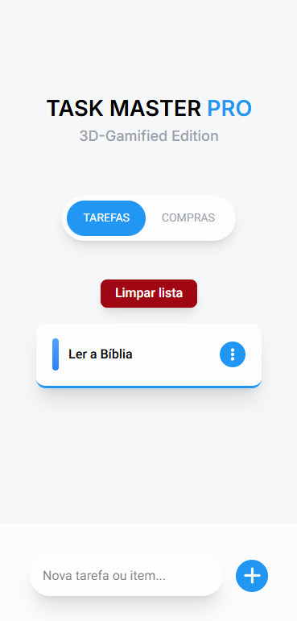
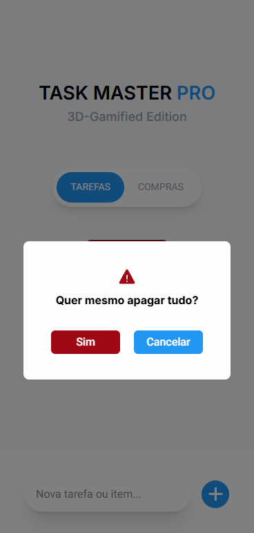

# 🏆 Task Master Pro: 3D-Gamified Edition

> **Acesse o projeto:** https://react-task-master-seven.vercel.app/

O **Task Master Pro** é um gerenciador de tarefas moderno e intuitivo, desenvolvido com foco em alta performance e experiência do usuário (UX). O projeto destaca-se pela capacidade de alternar contextos entre **Tarefas Diárias** e **Lista de Compras**, mantendo uma interface limpa e animações fluidas.

## 📸 Preview do Projeto

  

    
    
<i>Visual moderno com foco em produtividade.</i>

  

  

    
    
<i>Segurança nas ações destrutivas.</i>

  

---

## ✨ Funcionalidades

- **Dual View System:** Alterne entre listas de tarefas e compras com estados independentes.
- **Gestão Eficiente:** Adição e exclusão de itens em tempo real.
- **UX Inteligente:** - Dropdown de opções com fechamento automático ao clicar fora.
  - Modal de confirmação para ações destrutivas (Limpar Lista).
- **Animações Suaves:** Transições leves via Tailwind CSS e Keyframes para uma sensação de aplicativo nativo.
- **Responsividade:** Layout adaptado para Desktop e dispositivos Mobile.
- **Gamificação (Em breve):** Sistema de recompensas e XP ao completar tarefas. 🚀
- **Edição de Itens (Em breve):** Possibilidade de renomear tarefas já criadas. ✍️

---

## 🚀 Tecnologias Utilizadas

Este projeto utiliza o que há de mais moderno no ecossistema **React**:

* **React.js** (Hooks: `useState`, `useEffect`, `useRef`, `useMemo`)
* **Tailwind CSS** (Estilização baseada em utilitários e transições)
* **React Icons** (Identidade visual clara e moderna)
* **JavaScript (ES6+)**
